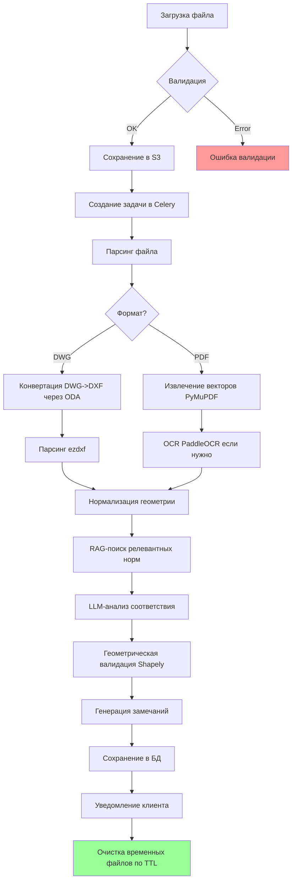

# AutoNormCheck - Система автоматического анализа проектной документации

## Архитектура системы

### Компоненты
1. **Frontend** (React + TypeScript)
   - Загрузка файлов (PDF/DWG)
   - Интерактивный просмотр с наложением маркеров
   - Фильтрация и экспорт замечаний

2. **Backend** (FastAPI + Python)
   - REST API для управления задачами
   - Оркестрация пайплайна обработки
   - Интеграция с очередью задач

3. **AI Workers** (Celery)
   - Парсинг DWG/PDF
   - Извлечение геометрии и текста
   - RAG-поиск по нормативной базе
   - LLM-инференс для генерации замечаний

4. **Хранилища данных**
   - PostgreSQL + PostGIS: метаданные, геометрия замечаний
   - Qdrant: векторное хранилище нормативных документов
   - MinIO (S3): файлы проектов и временные данные
   - Redis: кэш, брокер задач Celery

5. **Инфраструктура**
   - Docker + Docker Compose
   - Nginx (reverse proxy)
   - Prometheus + Grafana (мониторинг)

## Стек технологий

### Backend
- **FastAPI**: асинхронный веб-фреймворк
- **Celery + Redis**: очередь задач
- **SQLAlchemy + Alembic**: ORM и миграции БД
- **Pydantic**: валидация данных
- **ezdxf**: парсинг DXF/DWG
- **PyMuPDF (fitz)**: работа с PDF
- **PaddleOCR**: распознавание текста
- **OpenCV**: компьютерное зрение
- **Shapely + PostGIS**: геометрические операции
- **LangChain**: оркестрация LLM
- **Sentence Transformers (ruRoBERTa)**: векторизация текста
- **Qdrant Client**: работа с векторной БД

### Frontend
- **React 18 + TypeScript**
- **Vite**: сборка
- **React Query**: управление состоянием сервера
- **Zustand**: локальное состояние
- **react-pdf**: просмотр PDF
- **leaflet + react-leaflet**: карты и слои (для DWG через конвертацию)
- **TailwindCSS**: стилизация

### Инфраструктура
- **PostgreSQL 15 + PostGIS 3.3**
- **Qdrant 1.7**
- **Redis 7**
- **MinIO**: S3-совместимое хранилище
- **Celery Flower**: мониторинг задач

## Пайплайн обработки файла



### Механизм retry и fallback
- **Retry**: 3 попытки с экспоненциальной задержкой (1s, 2s, 4s)
- **Fallback DWG**: при ошибке конвертации -> попытка извлечения через libreDWG
- **Fallback OCR**: если PaddleOCR не справился -> Tesseract
- **Fallback LLM**: при таймауте/ошибке -> шаблонные правила проверки
- **Circuit Breaker**: отключение проблемных сервисов после 5 ошибок подряд

## Извлечение данных из DWG/PDF

### DWG Processing
```python
# 1. Конвертация DWG -> DXF (через ODA File Converter CLI)
# odaconvert input.dwg output.dxf

# 2. Парсинг DXF
import ezdxf

doc = ezdxf.readfile("output.dxf")
msp = doc.modelspace()

# Извлечение сущностей
entities = []
for entity in msp:
    entities.append({
        "type": entity.dxftype(),
        "layer": entity.dxf.layer,
        "coordinates": extract_coordinates(entity),
        "attributes": get_entity_attributes(entity)
    })

# 3. Нормализация координат в WCS
def extract_coordinates(entity):
    if entity.dxftype() == 'LINE':
        return {
            "start": list(entity.dxf.start),
            "end": list(entity.dxf.end)
        }
    elif entity.dxftype() == 'CIRCLE':
        return {
            "center": list(entity.dxf.center),
            "radius": entity.dxf.radius
        }
    # ... другие типы
```

### PDF Processing
```python
import fitz  # PyMuPDF
import cv2
import numpy as np

# 1. Извлечение векторной графики
doc = fitz.open("input.pdf")
vectors = []
for page in doc:
    paths = page.get_drawings()
    for path in paths:
        vectors.append(normalize_path(path))

# 2. Извлечение текста с позициями
text_blocks = []
for page in doc:
    blocks = page.get_text("dict")["blocks"]
    for block in blocks:
        if "lines" in block:
            for line in block["lines"]:
                for span in line["spans"]:
                    text_blocks.append({
                        "text": span["text"],
                        "bbox": span["bbox"],
                        "font": span["font"],
                        "size": span["size"]
                    })

# 3. OCR для растровых вставок
def ocr_page(page_pix):
    img = np.array(page_pix)
    results = paddle_ocr(img)
    return format_ocr_results(results)
```

### Семантическая классификация объектов
Используем дообученную модель LayoutLMv3 для классификации:
- Дорожные элементы (проезжая часть, тротуар, бордюр)
- Знаки и разметка
- Инженерные сети
- Элементы благоустройства
- Текстовые выноски и легенды

## Организация нормативной базы

### Структура хранилища
```
data/norms/
├── gost/
│   ├── gost_r_52289_2014.json
│   ├── gost_33150_2019.json
│   └── ...
├── sp/
│   ├── sp_34_13330_2021.json
│   └── ...
├── snip/
│   └── ...
├── pdd/
│   └── pdd_rf.json
└── metadata.json
```

### Схема чанка нормы
```json
{
  "id": "uuid",
  "document_id": "gost_r_52289_2014",
  "document_name": "ГОСТ Р 52289-2014",
  "document_type": "ГОСТ",
  "year": 2014,
  "status": "active",
  "section_number": "5.2.3",
  "section_title": "Требования к дорожным знакам",
  "content": "Текст требования...",
  "keywords": ["дорожные знаки", "видимость", "расстояние"],
  "vector_embedding": [0.12, -0.45, ...],
  "parent_section": "5.2",
  "child_sections": ["5.2.3.1", "5.2.3.2"],
  "related_norms": ["gost_33150_2019:4.1.2"]
}
```

### Стратегия обновления
1. Еженедельная проверка актуальности норм через API Минстроя
2. Ручное добавление новых документов администратором
3. Версионирование всех изменений
4. Инвалидация кэша RAG при обновлении

### RAG-поиск
```python
from langchain.vectorstores import Qdrant
from langchain.embeddings import HuggingFaceEmbeddings

# Инициализация
embeddings = HuggingFaceEmbeddings(
    model_name="cointegrated/rubert-tiny2",
    model_kwargs={'device': 'cuda'},
    encode_kwargs={'normalize_embeddings': True}
)

vectorstore = Qdrant(
    client=qdrant_client,
    collection_name="norms_collection",
    embeddings=embeddings
)

# Гибридный поиск
def search_norms(query: str, filters: dict = None):
    # Векторный поиск
    vector_results = vectorstore.similarity_search(
        query, 
        k=10,
        filter=filters  # фильтрация по статусу, типу документа
    )
    
    # BM25 поиск (через Elasticsearch или встроенный)
    bm25_results = bm25_search(query, filters)
    
    # Reranking
    combined = rerank_results(vector_results, bm25_results)
    
    return combined[:5]
```

### Правила матчинга
1. **Ключевые слова**: извлечение сущностей (дорога, тротуар, знак, ширина, высота)
2. **Геометрические параметры**: сравнение размеров с нормативными значениями
3. **Контекстный анализ**: LLM определяет применимость нормы к объекту
4. **Приоритизация**: критические нормы (безопасность) > рекомендации

## Логика привязки замечаний к координатам

### Системы координат
- **WCS (World Coordinate System)**: основная система хранения
- **Экранная система**: для отображения на фронтенде
- **Проекция**: при необходимости конвертация в СК проекта

### Форматы координат
```python
# Point
{"type": "Point", "coordinates": [x, y]}

# LineString  
{"type": "LineString", "coordinates": [[x1, y1], [x2, y2], ...]}

# Polygon
{"type": "Polygon", "coordinates": [[[x1, y1], [x2, y2], ..., [x1, y1]]]}

# Bounding Box
{"bbox": [min_x, min_y, max_x, max_y]}
```

### Определение локации замечания
```python
from shapely.geometry import Point, Polygon, LineString
from shapely.ops import unary_union

def determine_issue_location(entity, context_entities):
    """
    Определяет геометрию для замечания
    """
    if entity['type'] == 'TEXT':
        # BBox текста
        return create_bbox_polygon(entity['coordinates'])
    
    elif entity['type'] == 'LINE':
        # Линейный объект
        return LineString([entity['coordinates']['start'], entity['coordinates']['end']])
    
    elif entity['type'] == 'CIRCLE':
        # Полигон круга
        return create_circle_polygon(
            entity['coordinates']['center'],
            entity['coordinates']['radius']
        )
    
    elif entity['type'] == 'POLYLINE':
        # Полилиния -> LineString или Polygon если замкнута
        coords = entity['coordinates']['vertices']
        if is_closed(coords):
            return Polygon(coords)
        return LineString(coords)
    
    # Комбинированная геометрия для сложных случаев
    elif context_entities:
        related_geoms = [parse_geometry(e) for e in context_entities]
        return unary_union(related_geoms)
```

### Визуализация на фронтенде
```typescript
// Преобразование координат для отображения
function wcsToScreen(wcsCoord: number[], viewport: Viewport): ScreenCoord {
  const { origin, scale, rotation } = viewport;
  // Трансформация с учетом зума и поворота
  return transform(wcsCoord, origin, scale, rotation);
}

// Отрисовка маркера
interface IssueMarker {
  id: string;
  geometry: GeoJSON.Geometry;
  priority: 'CRITICAL' | 'IMPORTANT' | 'RECOMMENDATION';
  category: string;
  isSelected: boolean;
}

// Компонент маркера
const IssueMarkerComponent: React.FC<{ marker: IssueMarker }> = ({ marker }) => {
  const color = getPriorityColor(marker.priority);
  
  return (
    <GeoJSON 
      data={marker.geometry}
      style={{ 
        fillColor: color,
        weight: marker.isSelected ? 3 : 1,
        opacity: 0.8
      }}
      onHover={showTooltip}
      onClick={selectIssue}
    />
  );
};
```

## Формат выходного отчёта

### JSON-схема
```json
{
  "$schema": "http://json-schema.org/draft-07/schema#",
  "type": "object",
  "properties": {
    "project_id": {"type": "string", "format": "uuid"},
    "file_name": {"type": "string"},
    "file_hash": {"type": "string"},
    "processed_at": {"type": "string", "format": "date-time"},
    "processing_time_seconds": {"type": "number"},
    "summary": {
      "type": "object",
      "properties": {
        "total_issues": {"type": "integer"},
        "critical_count": {"type": "integer"},
        "important_count": {"type": "integer"},
        "recommendation_count": {"type": "integer"},
        "categories": {
          "type": "object",
          "additionalProperties": {"type": "integer"}
        }
      }
    },
    "issues": {
      "type": "array",
      "items": {
        "type": "object",
        "required": ["id", "priority", "category", "title", "description", "location"],
        "properties": {
          "id": {"type": "string"},
          "priority": {
            "type": "string",
            "enum": ["CRITICAL", "IMPORTANT", "RECOMMENDATION"]
          },
          "category": {
            "type": "string",
            "enum": [
              "ROAD_SAFETY",
              "ACCESSIBILITY",
              "LANDSCAPING",
              "PARKING",
              "DRAINAGE",
              "LIGHTING",
              "SIGNAGE",
              "DIMENSIONS",
              "CONFLICTS",
              "MISSING_ELEMENTS"
            ]
          },
          "title": {"type": "string"},
          "description": {"type": "string"},
          "regulation_reference": {
            "type": "object",
            "properties": {
              "document_id": {"type": "string"},
              "document_name": {"type": "string"},
              "document_type": {"type": "string"},
              "section": {"type": "string"},
              "full_text": {"type": "string"},
              "url": {"type": "string", "format": "uri"}
            }
          },
          "suggestion": {"type": "string"},
          "confidence_score": {"type": "number", "minimum": 0, "maximum": 1},
          "location": {
            "oneOf": [
              {"$ref": "#/definitions/Point"},
              {"$ref": "#/definitions/LineString"},
              {"$ref": "#/definitions/Polygon"}
            ]
          },
          "bounding_box": {
            "type": "array",
            "items": {"type": "number"},
            "minItems": 4,
            "maxItems": 4
          },
          "affected_entities": {
            "type": "array",
            "items": {"type": "string"}
          },
          "review_status": {
            "type": "string",
            "enum": ["PENDING", "CONFIRMED", "REJECTED", "RESOLVED"],
            "default": "PENDING"
          },
          "reviewer_comment": {"type": "string"},
          "reviewed_at": {"type": "string", "format": "date-time"},
          "reviewed_by": {"type": "string"}
        }
      }
    },
    "metadata": {
      "type": "object",
      "properties": {
        "dwg_layers_processed": {"type": "array", "items": {"type": "string"}},
        "pdf_pages_count": {"type": "integer"},
        "ocr_applied": {"type": "boolean"},
        "ai_models_used": {"type": "array", "items": {"type": "string"}}
      }
    }
  },
  "definitions": {
    "Point": {
      "type": "object",
      "properties": {
        "type": {"const": "Point"},
        "coordinates": {"type": "array", "items": {"type": "number"}, "minItems": 2, "maxItems": 2}
      }
    },
    "LineString": {
      "type": "object",
      "properties": {
        "type": {"const": "LineString"},
        "coordinates": {
          "type": "array",
          "items": {"type": "array", "items": {"type": "number"}, "minItems": 2, "maxItems": 2}
        }
      }
    },
    "Polygon": {
      "type": "object",
      "properties": {
        "type": {"const": "Polygon"},
        "coordinates": {
          "type": "array",
          "items": {
            "type": "array",
            "items": {"type": "array", "items": {"type": "number"}, "minItems": 2, "maxItems": 2}
          }
        }
      }
    }
  }
}
```

### Пример одного замечания
```json
{
  "id": "issue_20240115_001",
  "priority": "CRITICAL",
  "category": "ROAD_SAFETY",
  "title": "Недостаточная ширина тротуара",
  "description": "Ширина тротуара составляет 1.2м, что менее минимально требуемых 1.5м для данного типа улицы согласно нормативной документации.",
  "regulation_reference": {
    "document_id": "sp_34_13330_2021",
    "document_name": "СП 34.13330.2021 Автомобильные дороги",
    "document_type": "СП",
    "section": "5.4.2",
    "full_text": "Минимальная ширина тротуаров на улицах общегородского значения должна составлять не менее 1.5м.",
    "url": "https://docs.cntd.ru/document/1200181246"
  },
  "suggestion": "Увеличить ширину тротуара до 1.5м минимум за счет сужения проезжей части или пересмотра границ отвода земли. Альтернативно - обосновать применение меньшей ширины расчетом пешеходного потока.",
  "confidence_score": 0.94,
  "location": {
    "type": "LineString",
    "coordinates": [
      [1250.5, 3420.8],
      [1380.2, 3420.8],
      [1450.0, 3420.8]
    ]
  },
  "bounding_box": [1250.5, 3418.3, 1450.0, 3423.3],
  "affected_entities": ["polyline_127", "dimension_45"],
  "review_status": "PENDING"
}
```

## Безопасность и соответствие 152-ФЗ

### Технические меры
```yaml
# docker-compose.yml фрагмент безопасности
services:
  backend:
    environment:
      - ENCRYPTION_KEY=${ENCRYPTION_KEY}
      - DATA_RETENTION_DAYS=7
    volumes:
      - encrypted_storage:/data:rw
    security_opt:
      - no-new-privileges:true
    read_only: true
    tmpfs:
      - /tmp:size=1G
  
  postgres:
    environment:
      - POSTGRES_SSL_MODE=require
    volumes:
      - pg_encrypted_data:/var/lib/postgresql/data
```

### Шифрование
- **At rest**: AES-256 для дисков, S3, бэкапов
- **In transit**: TLS 1.3 для всех соединений
- **Ключи**: HashiCorp Vault или AWS KMS

### Изоляция данных
- Отдельные контейнеры для обработки каждого проекта
- Сетевая сегментация (backend не имеет прямого доступа в интернет)
- Ephemeral-хранилища для временных файлов

### Логирование и аудит
```python
import logging
from pythonjsonlogger import jsonlogger

logger = logging.getLogger(__name__)
logger.addHandler(JsonHandler())

# Структура лога
{
  "timestamp": "2024-01-15T10:30:00Z",
  "level": "INFO",
  "user_id": "uuid",
  "action": "file_uploaded",
  "resource": "project_123",
  "ip_address": "192.168.1.1",
  "user_agent": "...",
  "result": "success"
}
```

### Контроль доступа
- RBAC с ролями: Admin, Expert, Viewer
- JWT-токены с коротким временем жизни (15 мин)
- Refresh tokens с ротацией
- Двухфакторная аутентификация для экспертов

### Удаление данных
```python
from celery.schedules import crontab

@app.task
def cleanup_old_files():
    """Ежедневная очистка файлов старше TTL"""
    ttl_days = int(os.getenv('DATA_RETENTION_DAYS', 7))
    cutoff = datetime.now() - timedelta(days=ttl_days)
    
    projects = Project.objects.filter(created_at__lt=cutoff)
    for project in projects:
        # Удаление из S3
        s3_client.delete_objects(project.file_paths)
        # Анонимизация метаданных
        project.anonymize()
        logger.info(f"Cleaned up project {project.id}")
```

## Ограничения ИИ и минимизация рисков

### Confidence Score
```python
class IssueConfidence:
    HIGH = 0.85  # Автоматическое включение в отчет
    MEDIUM = 0.60  # Требует проверки экспертом
    LOW = 0.40  # Показывать только по запросу
    
    @staticmethod
    def calculate(rule_match_score, llm_score, geometric_score):
        weights = [0.4, 0.3, 0.3]
        return sum([
            weights[0] * rule_match_score,
            weights[1] * llm_score,
            weights[2] * geometric_score
        ])
```

### Human-in-the-loop workflow
```typescript
interface ReviewWorkflow {
  // Этапы проверки
  stages: [
    'AI_GENERATED',
    'EXPERT_REVIEW',
    'APPROVED_OR_REJECTED',
    'INCLUDED_IN_REPORT'
  ];
  
  // Действия эксперта
  actions: [
    'confirm',
    'reject',
    'modify_suggestion',
    'change_priority',
    'add_comment'
  ];
  
  // Обязательная проверка для
  mandatory_review_for: ['CRITICAL', 'confidence < 0.7']
}
```

### Валидация экспертом
```python
def validate_issue(issue: Issue, expert_decision: str, comment: str = ""):
    if expert_decision == 'REJECT':
        issue.review_status = 'REJECTED'
        issue.rejection_reason = comment
        # Логирование для дообучения модели
        log_rejection_for_training(issue)
    
    elif expert_decision == 'CONFIRM':
        issue.review_status = 'CONFIRMED'
        # Усиление весов для похожих случаев
        reinforce_similar_patterns(issue)
    
    elif expert_decision == 'MODIFY':
        issue.review_status = 'CONFIRMED'
        # Сохранение модификации для fine-tuning
        save_modification_for_finetuning(issue)
```

### Fallback на правила
```python
def check_with_fallback(entity, context):
    # Попытка AI-анализа
    try:
        result = ai_analyzer.check(entity, context)
        if result.confidence > 0.7:
            return result
    except Exception as e:
        logger.warning(f"AI analysis failed: {e}")
    
    # Fallback: детерминированные правила
    return rule_based_checker.check(entity, context)

# Пример правила
def rule_check_sidewalk_width(entity):
    if entity.type != 'SIDEWALK':
        return None
    
    width = calculate_width(entity.geometry)
    min_required = 1.5  # из кэша норм
    
    if width < min_required:
        return Issue(
            priority='CRITICAL',
            description=f"Ширина {width}м < {min_required}м",
            confidence=1.0  # Детерминированное правило
        )
```

### Аудит трассировки
```python
class AuditTrail:
    def log_issue_generation(self, issue: Issue):
        """Полная трассировка создания замечания"""
        audit_record = {
            "issue_id": issue.id,
            "timestamp": datetime.utcnow(),
            "source_entities": issue.affected_entities,
            "retrieved_norms": [
                {
                    "norm_id": norm.id,
                    "relevance_score": norm.score,
                    "search_query": norm.query
                }
                for norm in issue.retrieved_norms
            ],
            "llm_prompt": issue.llm_prompt_hash,
            "llm_response_tokens": issue.llm_token_count,
            "geometric_checks": issue.geometric_validations,
            "confidence_breakdown": issue.confidence_components,
            "model_versions": {
                "embedding": self.embedding_model_version,
                "llm": self.llm_version,
                "cv": self.cv_model_version
            }
        }
        self.audit_db.insert(audit_record)
```

## MVP-план на 3 месяца

### Месяц 1: Базовая инфраструктура и парсинг
**Цель**: Работающий пайплайн загрузки и извлечения данных

**Неделя 1-2**:
- [ ] Настройка Docker Compose окружения
- [ ] Развертывание PostgreSQL+PostGIS, Qdrant, Redis, MinIO
- [ ] Базовый FastAPI проект с авторизацией
- [ ] Модель данных Project, File, Issue

**Неделя 3-4**:
- [ ] Интеграция загрузки файлов в S3
- [ ] Парсинг PDF (PyMuPDF + базовое извлечение текста)
- [ ] Конвертация DWG->DXF (ODA CLI)
- [ ] Парсинг DXF (ezdxf) с извлечением геометрии
- [ ] Сохранение извлеченных данных в БД

**Deliverables M1**:
- Загрузка PDF/DWG работает
- Данные извлекаются и сохраняются
- Базовый API для получения списка проектов

**Метрики**:
- Успешная обработка 90% тестовых PDF
- Успешная обработка 80% тестовых DWG
- Время обработки файла < 30 сек (без AI)

### Месяц 2: AI-анализ и RAG
**Цель**: Генерация замечаний с привязкой к нормам

**Неделя 5-6**:
- [ ] Загрузка нормативной базы (10 ключевых документов)
- [ ] Чанкинг и векторизация норм
- [ ] Интеграция RAG поиска (Qdrant + rubert-tiny2)
- [ ] Базовый LLM-промпт для анализа соответствия

**Неделя 7-8**:
- [ ] Геометрические проверки (Shapely)
- [ ] Привязка замечаний к координатам
- [ ] Расчет confidence score
- [ ] Сохранение замечаний в БД с геометрией

**Deliverables M2**:
- RAG-поиск по нормам работает
- Генерация замечаний для простых кейсов
- Координатная привязка замечаний

**Метрики**:
- Precision RAG > 75% на тестовой выборке
- Генерация >= 1 релевантного замечания на тестовый файл
- Время полного пайплайна < 2 мин

### Месяц 3: Интерфейс и production-ready
**Цель**: Полный пользовательский сценарий

**Неделя 9-10**:
- [ ] React приложение с загрузкой файлов
- [ ] Просмотр PDF с наложением маркеров
- [ ] Фильтрация замечаний по приоритету/категории
- [ ] Экспорт отчета (PDF, JSON)

**Неделя 11-12**:
- [ ] Workflow подтверждения/отклонения замечаний
- [ ] Логирование и аудит
- [ ] Очистка данных по TTL
- [ ] Нагрузочное тестирование
- [ ] Документация API и deployment guide

**Deliverables M3**:
- Полностью рабочий MVP
- Интерактивный просмотр замечаний
- Экспорт отчетов
- Production deployment script

**Метрики успешности MVP**:
- End-to-end обработка < 3 мин для файла до 50 страниц
- Пользователь может загрузить файл, увидеть замечания, подтвердить их
- >= 5 релевантных замечаний на комплексный чертеж
- Отсутствие утечек памяти при обработке 100+ файлов
- Успешное развертывание на test server

### Критерии перехода к Production
1. **Точность**: Precision >= 80%, Recall >= 70% на размеченном датасете (100+ файлов)
2. **Производительность**: 95-й перцентиль времени обработки < 5 мин
3. **Надежность**: Uptime >= 99%, автоматический recovery после сбоев
4. **Безопасность**: Пройден security audit, шифрование включено
5. **Юзабилити**: 5+ внешних пользователей подтвердили полезность
6. **Масштабируемость**: Горизонтальное масштабирование workers проверено

---

## Trade-offs и альтернативы

### DWG Конвертация
| Решение | Плюсы | Минусы | Выбор для MVP |
|---------|-------|--------|---------------|
| ODA File Converter | Высокая точность, поддержка новых версий DWG | Проприетарный, требует лицензии | ✅ Да |
| libreDWG | Open source, бесплатно | Поддержка старых версий, нестабильность | Fallback |
| Teigha SDK | Лучшая совместимость | Дорогая лицензия | Production v2 |

### LLM для анализа
| Решение | Плюсы | Минусы | Выбор |
|---------|-------|--------|-------|
| Локальная Llama 3 8B | Контроль данных, бесплатно | Требует GPU, качество ниже | ✅ MVP |
| GPT-4 через API | Лучшее качество | Данные уходят наружу, дорого | ❌ Не подходит для 152-ФЗ |
| YandexGPT | Русский язык хорошо | Облако РФ, но всё же облако | Рассмотреть для non-sensitive |
| Qwen 7B | Хороший русский, open weights | Требует тонкой настройки | ✅ Альтернатива |

### Векторная БД
| Решение | Плюсы | Минусы | Выбор |
|---------|-------|--------|-------|
| Qdrant | Rust, быстро, гибридный поиск | Меньше комьюнити чем у Pinecone | ✅ Да |
| pgvector | Всё в PostgreSQL | Медленнее на больших объемах | Для MVP ок |
| Milvus | Масштабируемость | Сложнее в деплое | Production |

### CV для чертежей
| Подход | Точность | Скорость | Сложность | Выбор |
|--------|----------|----------|-----------|-------|
| Rule-based + Shapely | Высокая для геометрии | Очень быстро | Низкая | ✅ Основа |
| Doobученная DETR | Средняя-высокая | Медленно | Высокая | v2 |
| LayoutLMv3 | Высокая для семантики | Медленно | Средняя | ✅ Для текста |

---

## Следующие шаги для команды разработки

1. **DevOps**: Развернуть docker-compose окружение локально
2. **Backend**: Реализовать models и API endpoints для загрузки
3. **Data Engineer**: Подготовить датасет нормативных документов для чанкинга
4. **ML Engineer**: Настроить пайплайн векторизации и RAG поиска
5. **Frontend**: Создать прототип интерфейса загрузки и просмотра

Все компоненты готовы к началу разработки. Архитектура масштабируема и учитывает требования безопасности 152-ФЗ.
